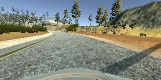
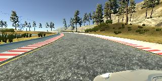
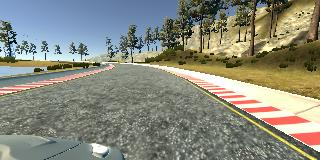
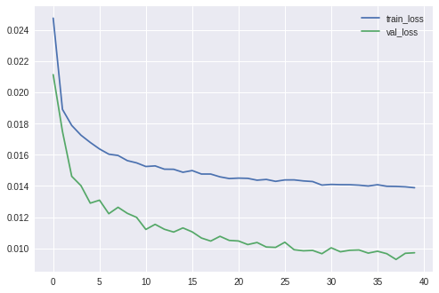

# Behavioral Cloning Project

## Overview
---
The objective of this project is to train the computer to drive the car on the tracks provided by Udcity simulator. The computer needs to be trained using the simulator images provided by udacity. The concepts of Deep Learning and Convolutional Neural Networks are applied here to make the car drive safely and autonomously through the track. 

The model is trained by feeding the data gathered from simulator in the form of images captured from three dashboard cameras left, center and right. This training data has a assciated ground truth labels which are stored in csv file and it contains mappings of left, center and right images and the corresponding steering angle, throttle, brake and speed. 

Using Keras Deep learning framework we can create a ".h5" file which we can test later on simulator. The challenge in this project is to collect all types of training data and train the model so that it will respond correctly to all types of scenes on track without overfitting and underfitting. 

## Model Architecture and Training Strategy
---
After exploring different models like AlexNet, VGGNET I decided to go with the model from NVDIA. The model architecture is described in [a paper by Nvidia](http://images.nvidia.com/content/tegra/automotive/images/2016/solutions/pdf/end-to-end-dl-using-px.pdf).  

The model includes ELU layers to introduce nonlinearity, and the data is normalized in the model using a Keras lambda layer.

### Training Data
Training data provide by Udacity was not enough and vehicle was not recovering well during sharp turns just by using provided data. I drove vehicle in many different conditions and gathered many scenarios to recover vehicle on track, if diverted.Also, I used images from left and right cameras of vehicle with some correction factor, this collectively made good collection of data in different scenarios.

### Preprocessing
I decided to shuffle the images so that the order in which images comes doesn't matters to the CNN. I also flipped the images and angles so as to have more reliable dataset in minimum driving which would train network how to compute steering wheel measurement equivocally.
After the collection process, I had around 30,000 examples. 
When I plotted these examples with respective steering wheel measurements, I had a clear picture that most of images were to drive straight which would make vechicle to take biased decision. To reduce these samples, I implemeneted functionality using keep_prob that would delete entries once average expected measurements are reached.
I finally randomly shuffled the data set and put 20% of the data into a validation set.

### Model parameter tuning
I tried different gradient descent optimizers like Momentum, Adagrad, Nadam, SGD, Adam. I had a promising results from Adam where training and 
validation loss converged pretty consistently.

